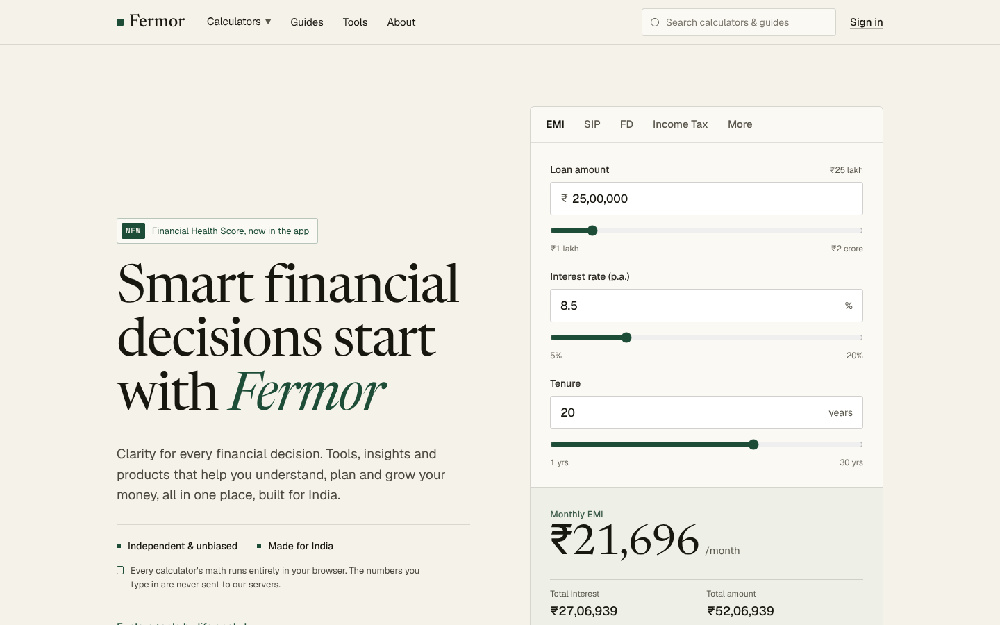
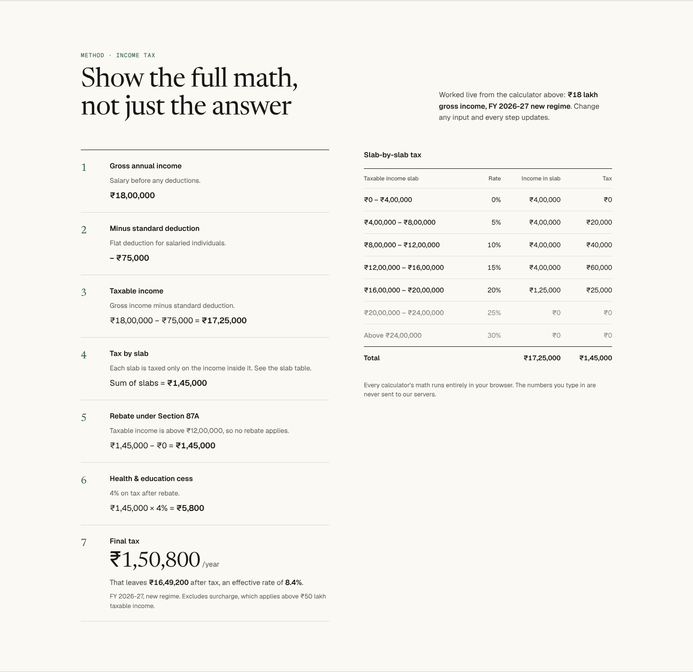
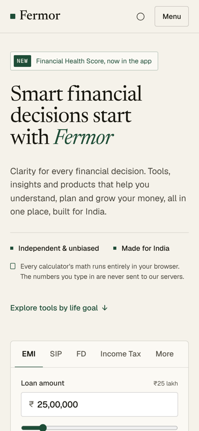

# Fermor Homepage

A new homepage for [Fermor](https://fermor.in), built as a frontend assignment.

**Live demo:** _add your Vercel URL here_



## The idea

Fermor's real differentiator is not that it has calculators. Every bank and finance site has calculators. It is that Fermor **shows the full math** and runs everything in the browser.

So the homepage does not describe that idea, it demonstrates it:

1. **The hero is a working calculator**, not an illustration. A visitor gets a real answer within seconds of landing, with no signup, which is Fermor's primary action.
2. **"See how this is calculated"** scrolls to a worked solution built from the visitor's own inputs: every step, the formula with their numbers substituted, and a year-by-year table. Change an input and every step updates live.
3. Everything after that (goals, principles, the Financial Health Score) supports the trust the first two sections earn.

## Screenshots

| Full math (income tax, ₹18L) | Mobile |
| --- | --- |
|  |  |

## Setup

Requires Node.js 18.18 or newer.

```bash
npm install
npm run dev      # http://localhost:3000
npm test         # calculator unit tests
npm run build    # production build
```

On Windows, if `next dev` fails due to Turbopack or path issues, run `npx next dev --webpack`.

## Stack

- **Next.js 15** (App Router) and **React 19**, statically prerendered
- **TypeScript** in strict mode
- **Tailwind CSS v4** with design tokens defined in `app/globals.css`
- **Vitest** for the calculator logic
- Fonts: **Newsreader** (display serif) and **Geist** / **Geist Mono**, all self-hosted

## Project structure

```
app/
  layout.tsx            fonts, metadata
  page.tsx              page composition
  globals.css           design tokens (colour, type, breakpoint)
components/
  CalculatorContext.tsx shared state: active tab, inputs, open-calculator action
  Header.tsx            nav, Calculators mega-menu, search, mobile menu
  CalculatorCard.tsx    hero calculator with tabs, inputs, sliders, results
  MathSection.tsx       worked steps, typeset formula, year-by-year table
  Goals.tsx             goal picker
  Principles.tsx        principles and Financial Health Score card
  Closing.tsx           closing CTA and footer
lib/
  calc.ts               pure financial functions (EMI, SIP, FD, income tax)
  calc.test.ts          unit tests with hand-verified values
  calculators.ts        input specs and view models for the UI
  content.ts            static copy
  format.ts             Indian number formatting (lakh / crore)
```

## Decisions

**Calculation logic is pure and tested.** All financial math lives in `lib/calc.ts` with no React in it. Components only render. The tests pin hand-verified results, for example a ₹25L loan at 8.5% for 20 years gives an EMI of ₹21,696, and ₹10,000/month SIP at 12% for 10 years gives ₹23,23,391. On a finance homepage, a wrong number is the worst possible bug.

**Income tax follows FY 2026-27 rules, including marginal relief.** New regime slabs, ₹75,000 standard deduction, 4% cess, and the Section 87A rebate up to ₹12L taxable income. Just above ₹12L, marginal relief caps the tax at the income above ₹12L (₹12.9L gross pays ₹15,600, not ₹64,740). Surcharge is out of scope and the UI says so.

**The math section follows the active calculator.** Switching to SIP, FD or Income Tax swaps in that calculator's own worked steps and table, not a fixed EMI example.

**Editorial visual direction.** A serif display face, warm off-white paper, one deep green accent, hairline rules and tabular figures. The aim was to feel like a careful financial publication rather than a generic fintech template. There are no stock photos or illustrations: the numbers are the imagery.

**Indian number formatting everywhere.** ₹25,00,000 rather than ₹2,500,000, with lakh and crore hints beside money inputs.

**No third-party requests.** Fonts are self-hosted, and the page loads nothing from other domains. That keeps the "your numbers never leave your browser" promise honest.

**Accessibility.** Calculator and goal tabs use proper tab roles, inputs have labels, the Calculators menu works with mouse, touch and keyboard (Escape closes it and returns focus), the mobile menu locks page scroll, and motion respects `prefers-reduced-motion`.

**Content kept honest.** All copy is taken from fermor.in. There are no invented testimonials, user counts, ratings or partner logos. The Financial Health Score card is clearly labelled as an example.

## What I would do next

- Real routes for each calculator, so links and search results land on dedicated pages
- Persist inputs in the URL so a calculation can be shared
- Old vs new regime comparison in the tax calculator
- Surcharge handling above ₹50L taxable income
